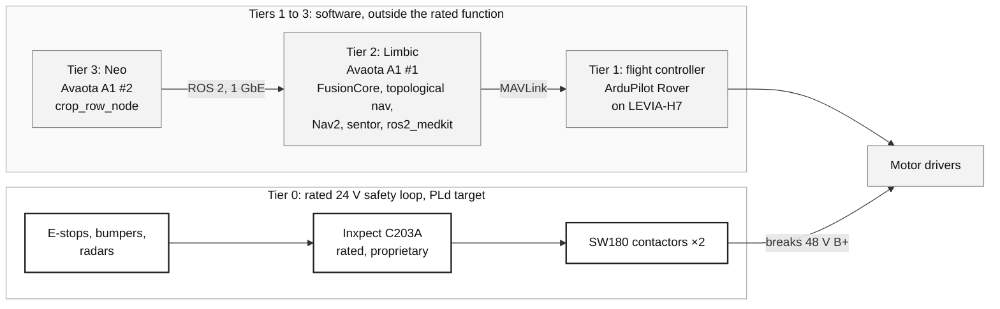
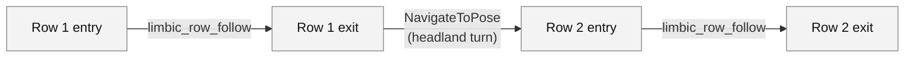
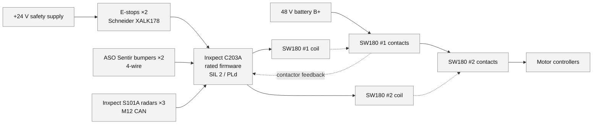
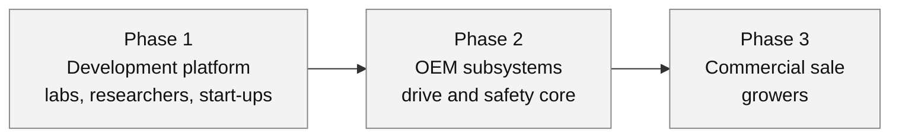

# Sowbot: an open reference architecture for a small autonomous field robot

| | |
|---|---|
| **Version** | 2.1.0 (draft), 9 October 2026 |
| **Basis** | Sowbot Safety Roadmap v0.6.9; `feldfreund_devkit_ros`, branch `caatinga-dev`; sowbot.co.uk/hardware |
| **Licence** | ROS 2 and Python software: MIT and Apache-2.0, by package. ArduPilot layer: GPL-3.0. Hardware: CERN-OHL-S-2.0 [confirm: the site says "open licences" and the repository names none] |
| **Platform** | Sowbot DevKit on the Open Core compute module. Sowbot Mini and Sowbot Pico are development chassis |

---

## Summary

Sowbot is an open-source ROS 2 stack and open hardware design for a small autonomous field robot. It is developed by the Agroecology Lab and builds on the Zauberzeug Feldfreund devkit.

Two ARM single-board computers run navigation, state estimation and vision. A flight controller running ArduPilot Rover drives the motors. A separate 24 V safety loop, built around the Inxpect C203A safety controller, cuts the 48 V traction supply on an E-stop, a bumper contact or a radar detection.

The C203A runs Inxpect's certified firmware. It is the only proprietary controller in the design. The stop function does not depend on any Sowbot software, so the rest of the stack can be open and can change without re-assessing the safety function.

The safety loop targets ISO 13849-1 Performance Level d (PLd). No PLd calculation is complete, no third party has assessed the design, and no compliance with any standard is claimed.

---

## 1. Background

A field robot that drives itself along a row of lettuce is no longer unusual. A robot that a researcher can open up, a small farm can repair and a toolmaker can build on still is. Most of the machines that work today are closed products. The people who most need to understand them cannot see inside: researchers who want to test a navigation method, growers who want to repair what they own, and the small companies that make weeding and seeding implements, who have to buy a complete robot to try one tool.

Two problems sit at the centre of field robotics. The first is driving along a crop row without damaging the crop. The second is stopping when a person appears. In both, people need to be able to inspect each other's work, and a closed product prevents that.

Sowbot builds on the Zauberzeug Feldfreund devkit and is developed by the Agroecology Lab. The aim is a small robot whose whole stack is open, safety design included, and which a university lab or a smallholding could run. The navigation, vision and drive code are open source. The one closed part is the certified safety controller. It is bought in because certified firmware cannot sensibly be written from scratch, and it allows everything else to stay open and to change without re-assessing the stop function.

The pieces now exist and have been run in simulation or on the bench. Multi-row missions run in Gazebo, a row follower has been tested against a lettuce crop in the UK, and the whole stack builds with one command. The work ahead is to put these together on a vehicle in the field and to finish the safety loop. This paper records where each piece stands.

---

## 2. Design decisions

**Rated safety function in one part.** E-stops, bumpers and radars connect to the C203A. It drives two contactors in series on the 48 V bus. The Sowbot computers can command motion but cannot override the stop.

**Two computers with separate roles.** Limbic runs state estimation, navigation and mission control. Neo runs the camera and vision models. Both are Avaota A1 boards (Allwinner T527) running Armbian with Docker, joined by one Ethernet cable.

**Layers for integrators.** System integrators are expected to work at the ROS 2 and Python layer, which is licensed MIT and Apache-2.0. They can build and sell their own robots on it. Beneath it sits an open MCU layer: ArduPilot on the LEVIA-H7 (GPL-3.0) and open hardware. The two layers communicate over MAVLink. The one closed part is the Inxpect C203A, which integrators buy in.

**Topological navigation with visual row following.** Missions are routes through a graph of headland and row nodes. A camera-based follower steers inside the crop rows. Free-space planning is limited to headland turns.

---

## 3. Status

Most items below have been tested in simulation or on the bench. Full-vehicle field validation is the next step.

| Item | Status |
|---|---|
| Multi-row mission following | Runs end to end in Gazebo |
| Visual crop-row following | Tested against a lettuce crop in the UK |
| RTK localisation | Dual F9P heading, NTRIP corrections and FusionCore fusion built and in the launch files. Hardware test pending |
| Containerised stack | ROS 2 Jazzy in Docker. `./manage.py full-build`, web cockpit, one-command Gazebo launch |
| Web cockpit | Joystick, e-stop, and a mission planner that builds swaths and rows from four field corners |
| Monitoring | `sentor` monitors and `ros2_medkit` logging. Simulation only so far |
| Open Core module | Fabricated, under test |
| ArduPilot on LEVIA-H7 | Current work. Board port with hwdef and CI builds of ArduRover. Bench-validated on Copter. Rover not yet run on a vehicle |
| Safety loop | Bench build in progress |
| PREEMPT_RT kernel on Limbic | Planned |
| Independent geofence | Planned |

### 3.1 Known limitations

- No full-vehicle field validation yet. Navigation is validated in simulation and row following on a crop, not the two together on hardware.
- ArduPilot Rover has not been run on a vehicle.
- No PLd claim can be made. The evidence listed in section 5.5 is outstanding.
- The radar detection envelope is not sized and radar mounting is not validated on the vehicle.
- Rollaway on slopes is not assessed and the design has no parking brake.
- Antenna lever arms are unmeasured and the optical flow configuration is not field validated.
- Limbic has no bounded-latency guarantee until a PREEMPT_RT kernel is in place.
- All geofencing is supervisory until the independent geofence is built and assessed.
- The rated function stops the vehicle. It does not cover implements, PTO or manipulators.
- The stop depends on one vendor's closed controller.
- The hardware licence is not yet stated in the repository.

---

## 4. Architecture

Both Avaota A1 boards run [Armbian](https://armbian.com/boards/avaota-a1) with Docker. The application code for Limbic and Neo is dockerised on Ubuntu 24.04, from the `ros:jazzy` base image.

### 4.1 Navigation

Nodes are headland points, row entries and row exits. Each edge carries the action used to travel along it.

The stack uses the LCAS `topological_navigation` package (`aoc_refactor` branch) with A\* route planning. Edge actions are row traversal, Nav2 goals and goal alignment. In-row edges call the `limbic_row_follow` action server. Headland edges use Nav2. The web UI builds the graph from four field corners using Fields2Cover.

### 4.2 Localisation

Inputs are two u-blox F9P receivers in moving-base configuration (RTK position and heading from `NAV-RELPOSNED`), NTRIP corrections, wheel odometry and the LEVIA-H7's dual BMI270 IMUs. FusionCore, a third-party 23-state Unscented Kalman Filter (Kharwar, arXiv 2605.25239), fuses them.

Two FusionCore limits apply. Yaw is unobservable without a heading source, and dual-antenna heading covers this only while both receivers hold a fix. GNSS blackouts longer than about 5 to 7 minutes accumulate heading error. Neither limit has been tested on the vehicle. Antenna lever arms are still zero placeholders.

### 4.3 Optical flow

Tracked and skid-steer machines slip, and odometry from slipping tracks over-reports distance. A ground-facing optical flow sensor measures motion over the soil directly.

`optical_flow_ros` (Kamath, Apache-2.0) is a ROS 2 lifecycle driver for the PMW3901 and PAA5100 sensors. It publishes `nav_msgs/Odometry` at about 100 Hz with health diagnostics. FusionCore takes it as a second twist source (`encoder2`).

- The sensor measures forward and sideways speed only. The driver publishes zero yaw rate, so FusionCore is configured to fuse the `vx` and `vy` channels only.
- FusionCore blends the two sources by their noise settings. It does not detect slip by itself. The noise values decide which source wins when they disagree.
- FusionCore provides a tracked-robot configuration (`tracked_flow_f9p.yaml`). It is not field validated and its noise values are starting points.
- The driver is written for Raspberry Pi SPI and GPIO and needs porting to the Sowbot boards.
- The PAA5100 is the short-range variant, so sensor height has to be checked against chassis ground clearance.
- The sensor's pixel-to-distance scale is proprietary and set by a tuning parameter.

The repository also contains a research proposal on terramechanics-informed estimation, which is at simulation stage.

### 4.4 Row detection

`crop_row_node` on Neo segments vegetation with ExG and Otsu thresholding, masks weeds with YOLOX-Nano detections, and finds rows with the Triangle Scan Method (de Silva, Cielniak and Gao, arXiv 2209.14003). A row-swap hold with a 6 s debounce prevents jumping between rows. The action server stops if the Neo heartbeat (`/aoc/heartbeat/neo_vision`, 5 Hz) stops.

The design targets the T527 NPU. The current Docker image uses CPU-only PyTorch.

### 4.5 Drive control

ArduPilot Rover runs on the LEVIA-H7 (STM32H743). Limbic talks to it over MAVLink through `devkit_mavlink_bridge`.

- Outbound: `cmd_vel` is converted to `SET_POSITION_TARGET_LOCAL_NED` and sent every 0.5 s, inside ArduPilot's 3.0 s GUIDED timeout.
- Inbound: FusionCore's pose passed to ArduPilot as `GPS_INPUT` is not yet implemented.
- ODrive motor drivers can run from ArduPilot through a Lua script.

### 4.6 Supervision

`sentor` monitors the e-stop and bumper topics, battery, camera, odometry, the Neo heartbeat and node liveliness. It publishes `/safety/heartbeat` and `/warning/heartbeat`. `ros2_medkit` provides black-box logging. All of this is diagnostic and outside the rated function.

Not yet done: a hardware test of the monitors, a battery cutoff value, and a `diagnostic_aggregator` feeding a single `/safety/level` topic.

### 4.7 Real-time kernel

A PREEMPT_RT kernel is planned for the Limbic host (Armbian), which the containers share, with `isolcpus=4-7`, the RTK filter on core 2 under SCHED_FIFO, navigation on cores 4 to 6 and a watchdog on core 5. Until this is in place, Limbic has no bounded-latency guarantee.

### 4.8 Interfaces

- **ROS 2 Jazzy:** the DevKit driver exposes the robot's topics, including `cmd_vel`, `/imu/data` and the safety and warning heartbeats.
- **Web cockpit:** NiceGUI interface with joystick, e-stop, topological map, mission queue and telemetry. Missions are entered as four field corners and turned into rows with Fields2Cover.
- **MAVLink:** Limbic to the ArduPilot flight controller, through `devkit_mavlink_bridge`.
- **DroneCAN:** planned for motor drivers. CAN on the LEVIA-H7 is routed but not yet validated.
- **Zenoh (`rmw_zenoh_cpp`):** intended for the Limbic to Neo link. CycloneDDS peer configuration is used today.

---

## 5. Safety

### 5.1 Scope

The rated function is whole-vehicle emergency motor stop. It acts through two series contactors on the 48 V bus. Inputs are E-stops, bumpers and human-detection radar.

Everything else is supervisory and is not part of the PLd calculation: ROS 2 nodes, `sentor`, flight controller firmware, vision and all current geofencing. The function does not cover implement, PTO or manipulator hazards.

The C203A runs Inxpect's certified firmware on Inxpect's own board. It is the only proprietary controller in the design and the only logic in the stop path that Sowbot did not write.

### 5.2 Safety loop

Component specifications are in Appendix A.

### 5.3 Response time

The E-stop loop responds in under 30 ms. The radar responds in under 100 ms (catalogue figure). Combined detection-to-stop latency is about 100 to 130 ms. At the maximum speed of 1.6 m/s this is 0.16 to 0.21 m of travel before the drive stops. It does not include drive-train stopping distance. The result has not yet been checked against ISO 3691-4.

False stops caused by livestock are accepted.

### 5.4 Hazards

| ID | Hazard | Mitigation | Status |
|---|---|---|---|
| H1 | Crush or impact | Bumpers, E-stops and radar through the loop. Motion alarm and beacon | Detection envelope not yet sized |
| H2 | Rollaway after a stop on a slope | Worm-gear drive assumed to self-lock at 40:1 | Ratio not checked against the gearbox datasheet. No parking brake. Slope range not set |
| H3 | Undetected contactor failure | SW180 auxiliary microswitches | Needs a confirmed C203A feedback input |
| H4 | Radar misses a person | Three S101A on the C203A | Mounting geometry not fixed. Not validated on the vehicle |
| H5 | Boundary excursion | ArduPilot geofence fed by FusionCore (planned). Independent geofence (planned) | Open. Governed by ISO 18497-3 |

### 5.5 Required performance level

The ISO 13849-1 Annex A risk graph gives S2, F2 and P1, so PLr is d. The P1 rating depends on a motion alarm and beacon and on a speed range of 0.1 to 1.6 m/s. The alarm is not yet wired to the motion state and the justification is not written. Without P1 the result is PLr e, which this architecture does not meet.

The architecture is Category 3. A PLd claim needs:

- reliability data for the E-stops, bumpers, radars and C203A
- B10d for the SW180 under traction switching loads, and its well-tried status under ISO 13849-2
- a common cause failure checklist scoring 65 or more
- a diagnostic coverage figure (currently a range of 60% to under 90%, pending the contactor feedback input)
- a SISTEMA run on the final parameters
- radar mounting geometry fixed and validated on the vehicle with the manufacturer's mobile-application procedure

### 5.6 Human interaction

The robot signals motion with a Brigade alarm and a rotating beacon. The wiring of the alarm to the motion state is not yet done. People are detected by the three radars and by contact with the bumpers, and anyone can stop the robot with an E-stop. The speed range is 0.1 to 1.6 m/s. False stops, for example for livestock, are accepted.

An IDEM GLM wire-rope pull switch is available for demonstrations without radar. The alarm, beacon and pull switch are not part of the stop function.

### 5.7 Planned independent geofence

A separate dual-channel safety function acting on the same 48 V isolation. It is not built or assessed and is not in the calculation above. Until it is, all geofencing is supervisory.

- Hardware: two STEVAL-SILPLC01 boards (STM32H723, 1oo2), each with its own u-blox F9P. ST states the hardware was assessed by TÜV Italia against SIL 2 / PL d. The FMEDA and assessment report are available under NDA only.
- Firmware follows GeofenceSafely: bare-metal MISRA C, GNSS read as untrusted UBX binary, checks on checksum, timeout, fix type, accuracy and jamming or spoofing flags, and a missing or stale message counted as outside the fence.
- The two channels cross-check position over a separate link. Either channel alone can trip.
- A loss of power, clock or software must de-energise the output, using a toggling enable.
- The shutoff state is read back and tested periodically.
- Fence data is stored in two CRC-protected copies. Debug access is locked in production.

Open items: where the outputs enter the 24 V loop, an independent plausibility source for GNSS, and porting the firmware from its S32K358 origin to the STM32H723.

---

## 6. Hardware

### 6.1 Open Core module

A compute unit on a stackable 10 cm × 10 cm standard, in a sealed aluminium enclosure with M12 connectors. It holds the two Avaota boards, CAN, two RTK receivers and power regulation. Status: fabricated, under test. The flight controller is the LEVIA-H7. The site's bill of materials lists M22 connectors for the enclosure, which needs resolving.

### 6.2 Platforms

- **Sowbot (full size):** modular aluminium chassis, NEMA 34 motors, ODrive CAN drivers and sodium-ion batteries. The project is moving this platform to tracks and the body bill of materials is under review.
- **Sowbot Mini:** one-third scale on 1515 extrusion with Lynx tracks. Needs assembly and testing.
- **Sowbot Pico:** small tracked chassis, tested as a physical platform. The ArduPilot driver for its motor board compiles but has not run on hardware.

### 6.3 LEVIA-H7 ArduPilot port

The port (`levia-h7-ardupilot`, GPL-3.0) contains a hwdef, a bootloader and CI builds of ArduRover.

- Bench-validated with ArduCopter and a 4-in-1 ESC: dual BMI270 IMUs, barometer, compass, SD logging, motor outputs, GPS and an ELRS link.
- The repository states it is not flight qualified. The board ID is provisional and unreserved.
- CAN is routed to a transceiver and DroneCAN is enabled in the default parameters. CAN was not part of the validation.
- The IMUs originally fitted to the board were undocumented and are not supported. The validated build uses BMI270.
- USB-C is the bring-up link. UART7 is `SERIAL1`, but the pinout lists no connector for it.
- The default parameters configure two F9P receivers on the board's UARTs as a moving baseline (`GPS_TYPE` 17 and 18). Sowbot currently runs the F9Ps on Limbic. The GNSS path for ArduPilot has to be chosen.

### 6.4 Power

The safety design uses a 48 V traction bus and a 24 V safety supply. The 24 V supply feeds the E-stops, the C203A, the radars and the contactor coils. Two SW180 contactors in series break B+ on the traction bus. Radars connect to the C203A over M12 CAN.

---

## 7. Regulatory position and phases

| Phase | Audience | Scope | Gate |
|---|---|---|---|
| 1 (current) | Labs, researchers, start-ups | ArduPilot drive. Standards used as design references. Use at the user's own risk | No certification, no compliance claim |
| 2 | OEMs and start-ups integrating the drive and safety core | PLd-target hardware subsystem. Geofence defined as its own safety function. SOTIF assessment of radar degradation. IEC 61508 architecture review | Formal internal assessment |
| 3 | Commercial growers | Hardened safety subsystems | Full ISO 18497 compliance, ISO 13849 PLd certification or equivalent, third-party safety audit, field trial history, insurance and liability structure |

**Classification.** The devkit is partly completed machinery under the UK Supply of Machinery (Safety) Regulations 2008 (SI 2008/1597) and EU Machinery Directive 2006/42/EC. Each unit needs assembly instructions and a Declaration of Incorporation. CE or UKCA marking and third-party certification are not required at this classification. The Declaration and the H5 residual-risk disclosure are still to be written.

**EU Machinery Regulation (EU) 2023/1230** replaces the Directive from 20 January 2027. For EU sales after that date the documentation has to be written against it. The Regulation allows digital assembly instructions, adds cybersecurity requirements, treats software as a possible safety component and requires software update logging. The date for Northern Ireland is to be confirmed.

| Standard | Use |
|---|---|
| ISO 18497-1 to -4:2024 | Primary standard for the product class. Informal reference now. Required before Phase 3 |
| ISO 13849-1 | PLd target for the stop function |
| ISO 3691-4 | Method reference for detection envelope sizing. Written for AGVs |
| ISO 25119 | Design reference |
| IEC 61508 | Design reference |
| ISO 21448 (SOTIF) | Design reference for radar and vision degradation |

---

## 8. Next work

1. **ArduPilot Rover on a vehicle.** Run Rover on the LEVIA-H7. Implement the inbound `GPS_INPUT` path. Reserve a board ID. Choose the GNSS path. Identify the MAVLink UART. Validate CAN.
2. **First full row mission on the vehicle.** Measure antenna lever arms. Run the hardware localisation test. Run an optical-flow ground-velocity test on soil to set the noise values. Survey the topological map from a real field.
3. **Finish the safety loop.** Complete the bench build. Fix radar placement and validate on the vehicle. Define the steering fail-state on E-stop. Assess rollaway on slopes. Wire the motion alarm and write the P1 justification.
4. **PREEMPT_RT on Limbic.**
5. **Independent geofence.** Define it as a separate safety function with its own performance level. Integrate its outputs into the 24 V loop. Obtain the assessment evidence from ST.

The full register of open items (O1 to O32) is in the Safety Roadmap.

---

## 9. Licences and dependencies

Software in the repository is licensed under MIT or Apache-2.0, depending on the package. The root licence is MIT (Copyright Zauberzeug GmbH 2025, Agroecology Lab Ltd 2026). Upstream copyright notices must be retained, and Apache-2.0 components carry their NOTICE requirements. Dependencies keep their own licences.

| Component | Licence | Note |
|---|---|---|
| `sowbot_row_follow` | BSD-2-Clause | From caatingarobotics, with PRBonn and Agroecology Lab copyright |
| `topological_navigation` (LCAS) | Apache-2.0 | |
| FusionCore | Apache-2.0 | Third party |
| `ublox_dgnss`, YOLOX | Apache-2.0 | Check YOLOX-Nano weights terms before commercial use |
| `optical_flow_ros` | Apache-2.0 | Depends on Pimoroni's `pmw3901-python`. Check its licence |
| `sentor` | MIT | |
| Fields2Cover | BSD-3-Clause | |
| Forest3D | GPL | Simulation only. Must not ship in a product |
| Inxpect C203A | Proprietary | Rated safety controller. The only closed controller in the design |
| LEVIA-H7 board | CERN-OHL-S-2.0 | |
| `levia-h7-ardupilot` port | GPL-3.0 | Derived ArduPilot code. Copyleft applies to distributed firmware |

---

### 9.1 Notes for integrators

- **ROS 2 and Python layer (MIT, Apache-2.0):** can be modified and sold in a commercial robot. Licence notices must be kept.
- **ArduPilot layer (GPL-3.0):** anyone distributing the firmware, modified or not, has to provide its source under the GPL. Application code that talks to it over MAVLink runs as a separate program. Integrators should take their own legal advice on where this boundary lies for their product.
- **Simulation assets (Forest3D, GPL):** must stay out of shipped products.
- **Inxpect C203A (proprietary):** bought in, not redistributed.
- **Hardware (CERN-OHL-S-2.0, to be confirmed):** if this licence is confirmed, modified hardware designs that are distributed fall under its terms.

This paper is not legal advice.

---

## Appendix A. Safety component specifications

| Component | Role | Specification |
|---|---|---|
| Schneider XALK178 ×2 | E-stop input | 2×NC contacts. IP68 variant to confirm |
| ASO Sentir ×2 | Bumper input, front and rear | 4-wire fail-safe loop, EN ISO 13856-3 |
| Inxpect S101A ×3 | Human detection | 24 GHz FMCW radar, SIL 2 / PLd, range 0 to 4 m, minimum set distance 1 m, field of view 110° × 30°, maximum target speed 1.6 m/s, IP67, −30 to +60 °C |
| Inxpect C203A ×1 | Safety logic | Fortop code IT100024, Inxpect code 90304011. Up to 6 sensors, safety outputs, 24 V. Proprietary |
| Albright SW180 ×2 | Output, in series on 48 V B+ | 200 A continuous, 400 A peak, magnetic blowout, TVS-suppressed coils, auxiliary microswitches |

Source for the C203A: Fortop UK, shop.fortop.co.uk/en/en/c203a-ul-control-unit-200-series-it100024-90304011.html.

---

## References

- Sowbot Safety Roadmap v0.6.9, `safety_roadmap.md`, github.com/Agroecology-Lab/feldfreund_devkit_ros (`caatinga-dev`).
- Sowbot hardware page, sowbot.co.uk/hardware.
- R. de Silva, G. Cielniak and J. Gao, Vision based crop row navigation under varying field conditions in arable fields, arXiv 2209.14003.
- M. Kharwar, FusionCore, arXiv 2605.25239; github.com/manankharwar/fusioncore (including `tracked_flow_f9p.yaml`).
- A. Kamath, `optical_flow_ros`, github.com/adityakamath/optical_flow_ros.
- LCAS `topological_navigation`, github.com/LCAS/topological_navigation.
- GeofenceSafely, github.com/samuk/GeofenceSafely.
- LEVIA-H7, github.com/piecol/LEVIA-H7. `levia-h7-ardupilot`, github.com/samuk/levia-h7-ardupilot.
- Inxpect S101A and C203A instruction manual, SAF-IM-100S_7_00111_en_v1.6.
- ISO 13849-1, ISO 18497-1 to -4:2024, ISO 3691-4, ISO 12100, ISO 21448, IEC 61508.
- Regulation (EU) 2023/1230; Supply of Machinery (Safety) Regulations 2008 (SI 2008/1597).
